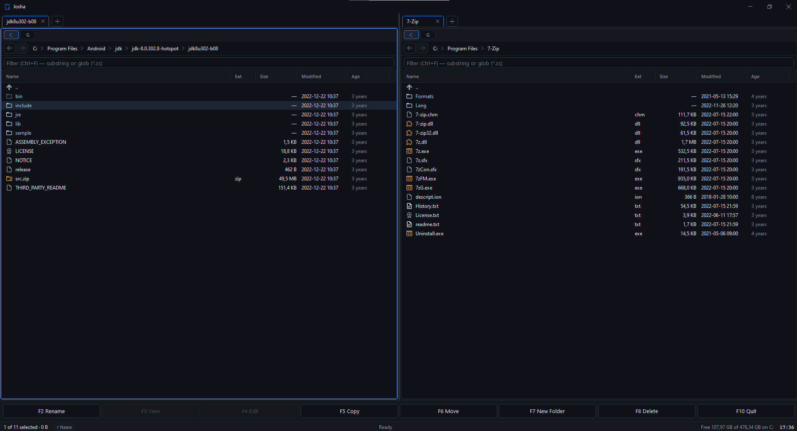

# Josha

A dual-pane keyboard-driven file manager for Windows. Total Commander muscle memory, modern WinUI-flavoured UI, integrated FTP/SFTP, and a built-in disk-usage tree view. Local and remote tabs share the same F5/F6 workflow — copy a file from your project to a server with the same keystrokes you use to copy it across folders.

> **Status:** active personal development. Windows-only. .NET 9 / WPF.



---

## Highlights

- **Dual-pane, tabbed.** Left and right columns, each with independent tabs. Each tab can be local or a saved FTP/SFTP site.
- **Three view modes per tab** (`Ctrl+1/2/3`):
  - **List** — sortable columnar view (default).
  - **Tiles** — icon grid.
  - **Disk Usage** — canvas-rendered tree graph with viewport virtualization, mouse-wheel zoom (0.1×–5×), click-drag pan, and live size totals (local tabs only).
- **Function-key file ops**: F2 rename, F3 view, F4 edit, F5 copy, F6 move, F7 mkdir, F8 delete (Shift+F8 permanent). All ops are async, queued, and retryable.
- **FTP / FTPS / SFTP** as first-class tabs. Plain FTP, FTPS explicit (AUTH TLS), FTPS implicit (port 990), and SFTP. Passive/active, configurable encoding, fingerprint pinning (`Strict` / `AcceptOnFirstUse` / `AcceptAny`).
- **Edit-on-server (F4 on a remote file).** Downloads to a temp file, launches your configured editor, watches the temp directory for changes (catches atomic-rename saves from VS Code, Vim, Notepad++), SHA-compares to skip no-op saves, and uploads back automatically.
- **Site Manager** with quick-connect: `Ctrl+Shift+1`–`9` opens your nine most-recently-used sites in a new tab.
- **Snapshot-backed disk usage.** A background scan keeps a per-drive `DirOD` tree on disk. Disk Usage view opens instantly; reconciliation re-scans only changed paths via NTFS mtime.
- **Bookmarks**, **command palette** (`Ctrl+P`), **toast notifications**, **light/dark theme**, **inline preview pane**.
- **Native shell context menu** (right-click files/folders) via Win32 `IContextMenu`.
- **No telemetry. No cloud sync. All data stays local.**

---

## Requirements

- Windows 10 1809+ or Windows 11.
- [.NET 9 SDK](https://dotnet.microsoft.com/download/dotnet/9.0).
- Optional: an external editor (VS Code, Notepad++, etc.) configured in Settings for F4 edit-on-server.

---

## Build & Run

```bash
git clone <repo-url> Josha
cd Josha
dotnet build Josha.sln
dotnet run --project Josha.csproj
```

The first launch creates `C:\josha_data\` for settings, snapshots, and saved sites.

---

## Keyboard reference

### File operations
| Key | Action |
|-----|--------|
| `F2` | Rename selection |
| `F3` | View (read-only internal viewer) |
| `F4` | Edit (launches your configured editor; uploads back if remote) |
| `F5` | Copy selection to other pane |
| `F6` | Move selection to other pane |
| `F7` | Create directory |
| `F8` / `Del` | Delete to recycle bin |
| `Shift+F8` / `Shift+Del` | Permanent delete |

### Navigation
| Key | Action |
|-----|--------|
| `Enter` | Open file / enter directory |
| `Backspace` | Up one level |
| `Alt+Left` / `Alt+Right` | History back / forward |
| `Tab` | Switch active pane |
| `Ctrl+Tab` / `Ctrl+Shift+Tab` | Cycle tabs in active column |
| `Ctrl+T` | New tab |
| `Ctrl+W` | Close tab |
| `Ctrl+1` / `Ctrl+2` / `Ctrl+3` | List / Tiles / Disk Usage view |

### Connections
| Key | Action |
|-----|--------|
| `Ctrl+N` | New connection sheet |
| `Ctrl+M` | Site manager |
| `Ctrl+Shift+1`–`9` | Quick-connect to recently-used site |

### Search & selection
| Key | Action |
|-----|--------|
| `Ctrl+F` | Focus filter bar |
| `Ctrl+H` | Toggle hidden files |
| `Ctrl+A` | Select all |
| `Ctrl+P` | Command palette |
| `+` / `-` | Select / deselect by pattern |

### Disk Usage view
| Key | Action |
|-----|--------|
| `Ctrl+Wheel` | Zoom |
| `Shift+Wheel` | Horizontal scroll |
| Click + drag | Pan |
| Right-click node | Open in Explorer / copy path |

---

## Configuration & data

Everything is stored under `C:\josha_data\`:

| File | Contents | Encryption |
|------|----------|-----------|
| `settings.json` | Theme, editor path, view defaults, font scale | none (no secrets) |
| `bookmarks.dans` | Path bookmarks | DPAPI |
| `sites.dans` | Saved FTP/SFTP sites + credentials | DPAPI |
| `tree.{letter}.daps` | Per-drive disk-usage snapshot | DPAPI |
| `logs/Josha-YYYY-MM-DD.log` | Diagnostic logs | none |

**Encryption.** All credentials, bookmarks, and snapshots are protected with **Windows DPAPI** (`DataProtectionScope.CurrentUser`). The protection key is managed by the OS and pinned to your Windows user profile + the physical machine. Per-component entropy strings (`Josha/sites/v1`, `Josha/bookmarks/v1`, etc.) prevent cross-component decryption.

**This means data is unrecoverable if:**
- the disk is moved to another machine,
- the Windows user profile is copied to a different account, or
- the OS / user SID changes.

On unprotect failure, files are moved aside as `<name>.dpapi-failed-<timestamp>.bak` rather than overwritten — so a failed read never destroys your only copy. This is by design: DPAPI is portability-hostile but credential-loss-safe.

If you need credentials/bookmarks to roam across machines, that's a different threat model and would need a passphrase-based scheme — not currently supported.

---

## TLS / SFTP host trust

When connecting to an FTPS or SFTP site, host validation is configurable per-site:

- **Strict** — the server certificate must chain to a trusted root. No trust-on-first-use.
- **Accept on first use** *(default)* — pin the SHA-256 fingerprint on first successful connection; reject on mismatch afterwards. The pin is persisted in the site record.
- **Accept any** — connect regardless. Provided for legacy environments only; not recommended.

---

## Project layout

```
Business/        Scanning, file ops, FTP/SFTP, persistence, shell integration
  Ftp/             FluentFTP / SSH.NET wrappers, connection pool, providers
Services/        AppServices, file-op queue, theme, toast, log, snapshot
Models/          Plain data: AppSettings, FtpSite, DirOD, Bookmark, ...
ViewModels/      MVVM layer (AppShell, PaneColumn, FilePane, FileList, ...)
Views/           XAML controls + sheets
Converters/      WPF value converters
Styles/          Theme.xaml (dark) + Theme.Light.xaml
```

For a deeper architectural map see [`CLAUDE.md`](./CLAUDE.md).

---

## Tech stack

- **.NET 9** (`net9.0-windows`), WPF.
- **[FluentFTP](https://github.com/robinrodricks/FluentFTP)** — FTP / FTPS client.
- **[SSH.NET](https://github.com/sshnet/SSH.NET)** — SFTP client.
- **[MahApps.Metro.IconPacks.Material](https://github.com/MahApps/MahApps.Metro.IconPacks)** — Material Design icons.
- **[Vanara.PInvoke.Shell32](https://github.com/dahall/Vanara)** — Win32 shell context-menu integration.
- **Windows DPAPI** (`System.Security.Cryptography.ProtectedData`) — credential and snapshot encryption.

Server GC + concurrent collection are enabled to keep the parallel disk scanner from causing long gen2 pauses.

---

## Known limitations

- **Windows-only.** WPF + Win32 + DPAPI; no plans for cross-platform.
- **No archive support** (zip/7z extraction or browsing). Use Explorer or 7-Zip for that.
- **Disk Usage view is local-only.** Remote providers don't expose a snapshot.
- **DPAPI scope is `CurrentUser`.** Saved sites do not roam.

---

## License

MIT
